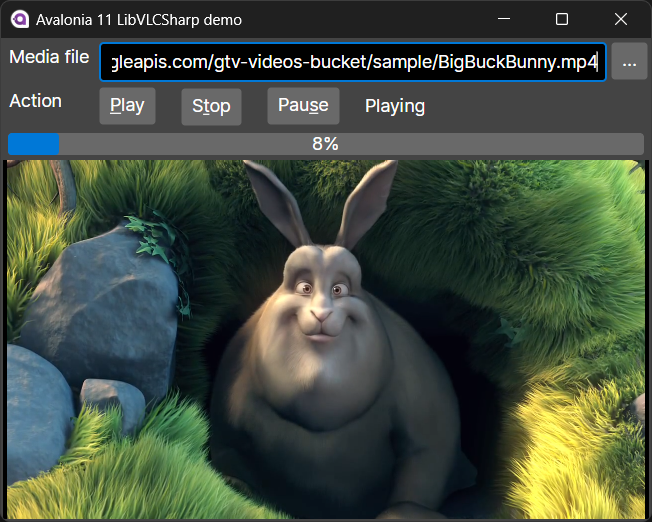

# LibVLCSharp.Avalonia.Unofficial for Avalonia 11

This is a fork of [radiolondra's mediaplayer for Avalonia](https://github.com/radiolondra/libvlcsharp), my goal was to make it run under Avalonia v11. ALL CREDITS to him for creating this, I merely  poked it with a stick until it compiled for Avalonia v11.
I decided to base my fork on [radiolondra's YAMP2](https://github.com/radiolondra/YAMP2) project rather than his LibVLCSharp fork because that one is a little bit too big with the whole VLC tree in there.

Once Avalonia V11 final is released, I'll be happy to do a PR into the original project.

## Screenshot

# YAMP2

#### Yet Another Media Player v2

###### Made with Avalonia and my new Unofficial LibVLCSharp.Avalonia library

##### Sample Video

[Watch YAMP 2 in action](https://www.screencast.com/t/uTGBnpE6v)

The official distribution of the *Videolan LibVLCSharp library for Avalonia* is, at present, incomplete and, to say the least, disappointing.

The list of shortcomings of that official distribution is certainly very long, but its, let's call them, *basic problems* are:

- **Inability to use the VideoView (the MediaPlayer) within an Avalonia UserControl.** So VideoView can only be inserted inside a Window object.

- **Impossibility to create a layer on top of the VideoView**, for example, to create a player control panel.

With a bit of *luck*, I managed **to overcome both of these problems** and I created this [Unofficial distribution of the library](https://github.com/radiolondra/libvlcsharp/tree/3.x/src/LibVLCSharp.Avalonia.Unofficial), deeply modifying the useless official one, so that anyone can have more satisfaction in their own applications when using *LibVLCSharp in Avalonia*.

This unofficial distribution of the library **has been tested with full success in Windows, Linux, MacOS and Raspberry Pi 3 (1GB RAM) with DietPi as operating system**.

Using my *Unofficial distribution*, I created **YAMP2** , a trivial media player (but with some goodies like, for example, the usage of [YT-DLP](https://github.com/yt-dlp/yt-dlp) to play videos from *Youtube*, *Vimeo* and others, without ads).

The code of **YAMP2** was written in a few hours and... <u>badly</u>, for sure. But it was created just to show everyone how to use the library as quickly as possible in the real world.

##### Build YAMP2

Just clone the repo, open the YAMP2 solution in VS2019, build and run it. Enjoy.

##### Some reference links

[c# - AvaloniaUI: Cannot embed VideoView control (LibVlcSharp) in a UserControl - Stack Overflow](https://stackoverflow.com/a/71696308/4973374)

[Video Player · Issue #2571 · AvaloniaUI/Avalonia · GitHub](https://github.com/AvaloniaUI/Avalonia/issues/2571#issuecomment-1084671987)

[Add support for NativeControlHost inside a UserControl · Issue #6237 · AvaloniaUI/Avalonia · GitHub](https://github.com/AvaloniaUI/Avalonia/issues/6237#issuecomment-1084914382)
